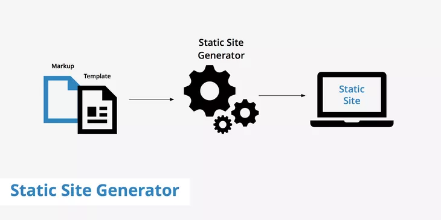
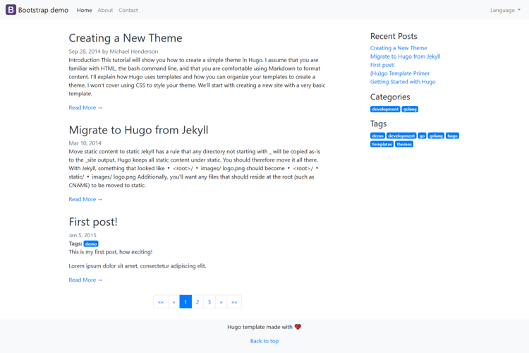
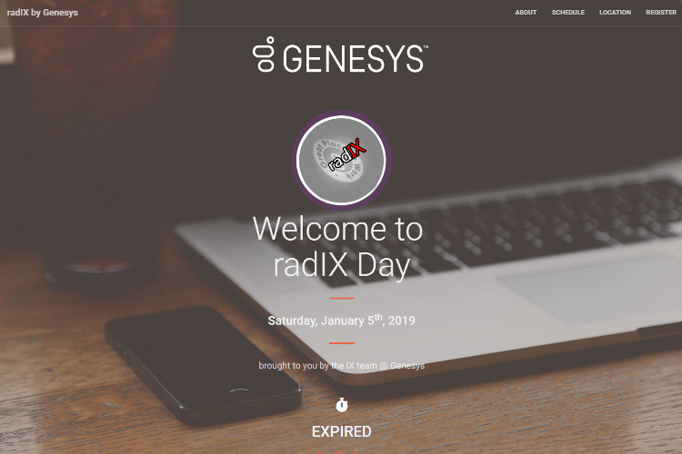
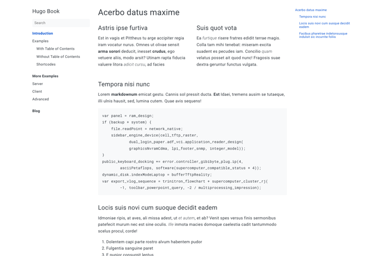
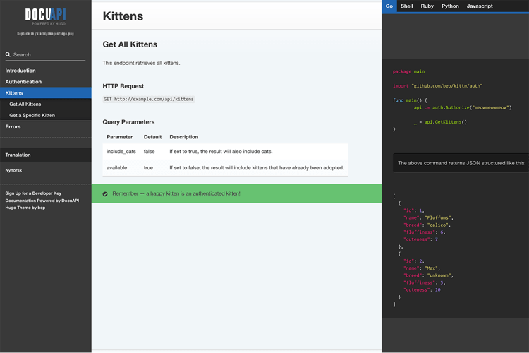
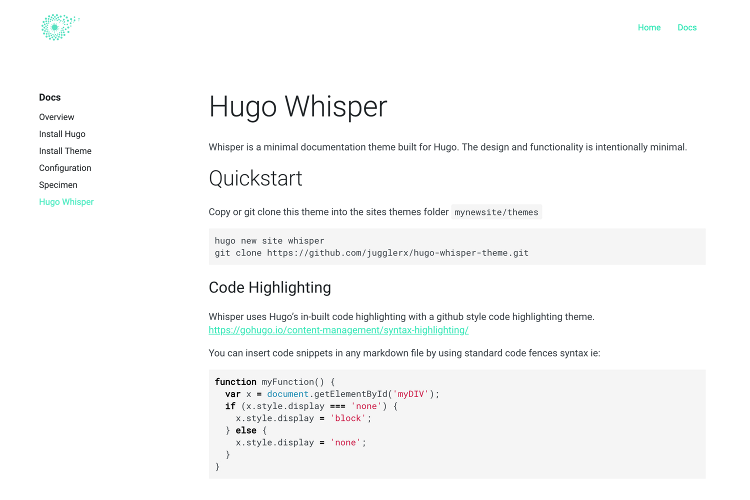

{}




# Hugo Primer

> STC India Chennai Regional Conference
>
> August 31, 2019

---


# I am Xavier.

I work at Genesys as a Staff Technical Writer.

<svg xmlns="http://www.w3.org/2000/svg" width="40" height="40" viewBox="0 0 24 24" fill="none" stroke="#00acee" stroke-width="2" stroke-linecap="round" stroke-linejoin="round" class="feather feather-twitter"><path d="M23 3a10.9 10.9 0 0 1-3.14 1.53 4.48 4.48 0 0 0-7.86 3v1A10.66 10.66 0 0 1 3 4s-4 9 5 13a11.64 11.64 0 0 1-7 2c9 5 20 0 20-11.5a4.5 4.5 0 0 0-.08-.83A7.72 7.72 0 0 0 23 3z"></path></svg> [@paperarrow](https://twitter.com/paperarrow)

---


# 🎙️

* An introduction to Hugo
* A live walkthrough to create a documentation site

{}

---


{}
# 😕
# What is Hugo?

---
 


Hugo is a **_static site generator_**.

---
 


<small>A **Static Site Generator (SSG)** takes **some text-based markup** and generates a _static_ website using some
templates.</small>

---
 

# Popular SSGs

* [Jekyll](https://jekyllrb.com)
* [Hugo](https://gohugo.io)
* [Gatsby](https://www.gatsbyjs.org)
* [VuePress](https://vuepress.vuejs.org)
* [Eleventy](https://www.11ty.io)
* and many more...

You can find more SSGs at [StaticGen](https://www.staticgen.com/).

{}

---


{}

# 🤔

## What can I use Hugo for?

---

## Blogs



---
## Landing Pages


---
## Conferences



---

## Presentations

## 🎉 

> Like the one you're seeing right now... 

## 🤩


---

## Resumes


---

## Documentation



---
## API Documentation



{}

---



{}

# 🧐 
## Who uses Hugo?

---

{}Google {} 

{}Kubernetes {}

{} Docker {}

{}Docker switched to Jekyll recently.{}

{}and many more companies for their docs...{}

{}

---



{}

# 🏁
## Using Hugo to create a site

---

## Install Hugo

---

- Download Hugo from https://github.com/gohugoio/hugo/releases.
  - Install the Hugo Extended version.
- Add to Windows 'PATH'.
```
setx path "%path%;<HUGO EXE Folder>"
```

* Verify if Hugo is installed correctly.
```
hugo help
```

 ---




## Create a Site

---
* Create a new site where the docs will reside.

```
hugo new site docsite
```

* Go to the **docsite** folder.
```
cd docsite
```

- Test if the site is created.

```
hugo server
```
Hugo will now create a temporary site at 
> http://locahost:1313


---


# Add a theme

---

We will be using the **Whisper** theme.



---

* Download the **Whisper** theme from https://github.com/JugglerX/hugo-whisper-theme/archive/master.zip
* Extract the downloaded zip file inside the **themes** folder in your `docsite` folder.

---

* Rename the extracted folder from _hugo-whisper-theme-master_ -> _hugo-whisper-theme_.
```
\docsite
- archetypes
- content
- data
- layouts
- resources
- static
- themes
-- hugo-whisper-theme
- config.toml
```

---



# Configure the site

---

Let's copy the entire contents of the **.\hugo-whisper-theme\exampleSite** folder to the **root** folder
of the Hugo site.

---
## Edit config.toml
```
baseURL = "/" 
title = "My Docs Site"
theme = "hugo-whisper-theme"
... Other parameters as required

```
---

## Test the site

Let's check how the site looks.

```
hugo server
```
Hugo will now create a temporary site at http://locahost:1313.

---

## Generate your site
```
hugo
```

The site will be now available at **public** folder for deployment. 

You can copy the contents to your website.

{}

---

 
# 🙋
##  Questions?

---

{}



> What is next?

---

##  Run a website for free

Hugo + Github + Netlify = 🆓🌐

---

## Hugo Workshop

Create a full-fledged documentation site with Hugo:

* Chapters
* Search
* ToC
* Indexes with tags

> Workshop Details : TBD


{}

---


