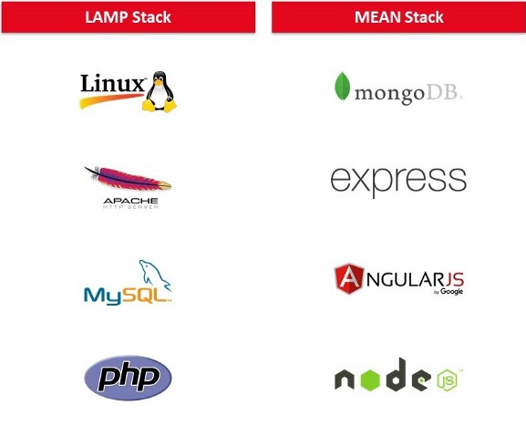
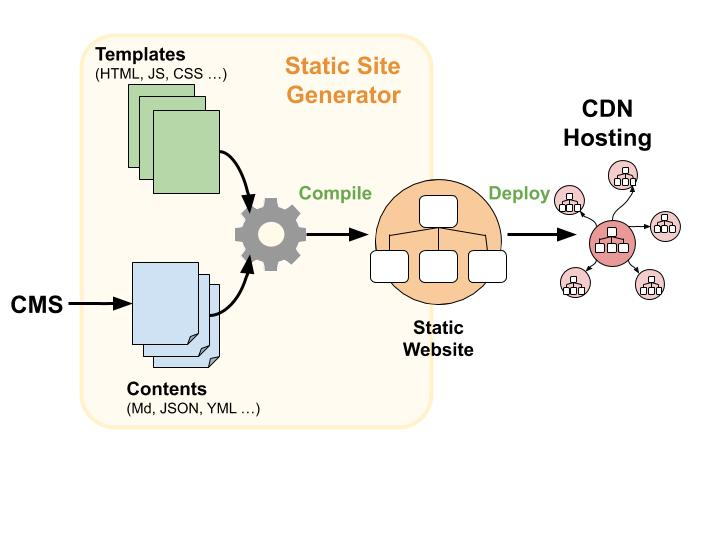
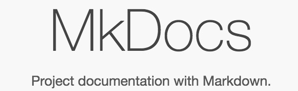
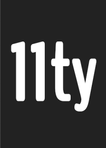
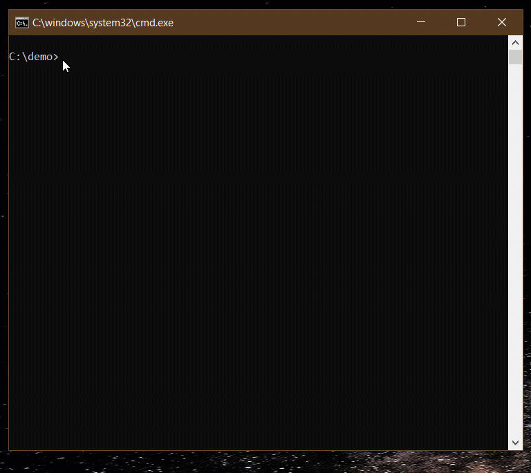
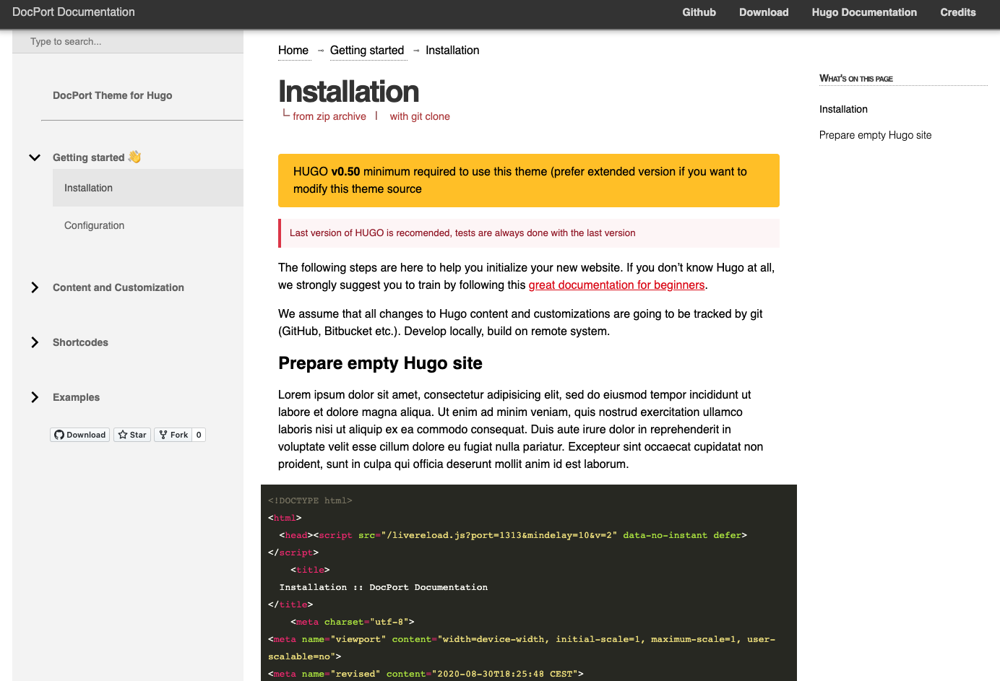
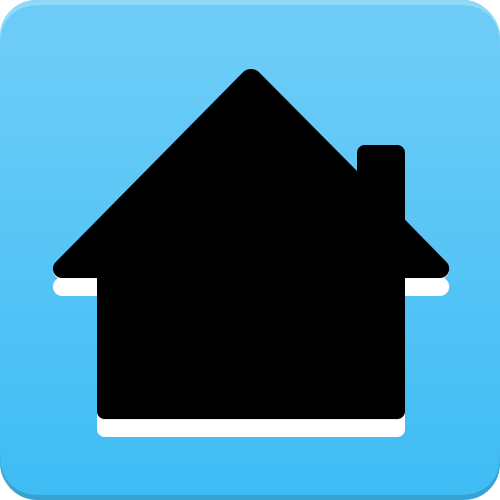




<div class="row">
  <div class="column">

  </div>
  <div class="column">
  
  </div>
</div>

{}
Hello everyone.
And welcome to radix day 2020.
I hoped you had enjoyed the first two presentations earlier today.


{}

---





## an introduction to


{}

Hope that this "introduction to jamstack" session is as informative as the previous ones.

{}

---




# I am Xavier.

I work at Genesys as a Staff Technical Writer.
<!--
* <i class="fas fa-globe"></i> [PaperArrow.com](https://paperarrow.com) 

* <i class="fab fa-twitter"></i>
 [@paperarrow](https://twitter.com/paperarrow)
-->
{}
I am Xavier and I work as a Staff Technical Writer at Genesys.

You can find my user assistance blog at paperarrow.com or on twitter @paperarrow.

{}


---

<!-- 
 


# once upon a time...

{}

Before we get on to the main topic, a small recap of the history of content on the web. 
- You had to write HTML with an editor like Dreamweaver or Microsoft FrontPage.
- You had to upload the files to a server using FTP.
- If there were any changes needed, rinse and repeat.

To use a technical writing analogy, 
this was 
- converting from Framemaker to PDF or 
- from Robohelp to Webhelp.
{}

---



### the age of the artisans


{}
Till web 1.0, it was specialists who did all of these work. Contributors just handed over the content and the developers took care of gettingit online.


{}


---

## the second web


{}

- As web 2.O started, contributers now wanted to make the changes themselves. 
- Web architecture had undergone changes. 
- The web servers now could handle a lot more than the previous generation. 
- They could generate pages dynamically.
- They could connect to databases.
- They could talk to each other through APIs

{}

---

## the stack revolution




<span class="fragment fade-in">

 

</span> 

<span class="fragment fade-up">

  

</span> 

{}
Web frameworks with PHP, Perl, Ruby, and Python became available for developers.

If we compare it to technical writing space, it was the availability of tools like Adobe TechComm Suite, Madcap Flare and Wiki software where the process that we saw in web 1.0 was lessened. 

The rise of Content Management Tools like Wordpress and Drupal made it even easier to publish online.

{}


---

## the Jamstack renaissance


<small>Source: https://www.gatsbyjs.com/blog/2018-10-04-journey-to-the-content-mesh/</small>


{}
As the web development frameworks grew and the rise of ubiquitous mobile devices, the need to make content available across devices became paramount.

The increasing spread on internet connectivity meant that anyone with enough network connectivity can access the internet.

If you remember, the stacks period had an overhead of the servers, if the server was down, everythign was down. 

The rise of CDNs with AWS and Google and MS Azure kicked off an interest in having sites that were pre-rendered. 


{}


-->

---


# What is Jamstack?

##### a modern Web development architecture

> Fast and secure sites and apps delivered by pre-rendering files and serving them directly from a CDN, removing the requirement to manage or run web servers 
> -- [jamstack.org](https://jamstack.org)

---
## What does the name mean?

##### Client-Side <u>J</u>avaScript
##### Re-usable <u>A</u>PIs
##### Pre-built <u>M</u>arkup
##### the <u>Stack</u> layers which deliver your website/app

---


## How a Jamstack site works?

* Everything (Content and Layouts) live in GIT repositories.
* Builds are automated whenever the repo is updated. (Continuous Integration)
* Deployment of pre-built markup to the CDN happens automagically. (Continuous Deployment)
* Everything is served from Content Delivery Network (CDN).**
* No servers are involved. (_Well, almost_).


---



--- 


# What is it in for me?

---

Technical Documentation is the most common use case and also the earliest Jamstack examples. 

Most static site generators (SSGs) began life as a solution for documentation.

---

# Why?
* the adoption of git-based tools
* the rising trend of docs-as-code approach
* the transformation of content from just text to a lot more
* the availability of Content Management tools
* the adoption of Create Once, Publish Everywhere (COPE) strategy


---


# How?

---



# [Pick any Static Site Generator](https://www.staticgen.com/)


---


# Static Site 
# Generators
## (SSGs)

---

## Documentation-specific SSGs

<div class="flex-container">
    <div class="flex-item">
        <a href="https://docsify.js.org//">docsify</a> 
    </div>
    <div class="flex-item">
        <a href="https://www.mkdocs.org/">MkDocs</a>
    </div>
    <div class="flex-item">
        <a href="https://slatedocs.github.io/slate/">Slate</a>
    </div>
        <div class="flex-item">
        <a href="https://vuepress.vuejs.org/">VuePress</a>
    </div>
        <div class="flex-item">
        <a href="https://docusaurus.io/">Docusaurus</a>
    </div>
</div>

{}

- docsify is a Javascript-based SSG that serves documentation as a single-page application that can support server-side rendering (SSR).
- mkdocs is a Ruby-based solution (that uses the Middleman SSG under the covers) and is geared specifically towards API docs.
- Slate is a Python-based solution that emphasizes its speed and themes.
- 


{}

---

# Popular SSGs


---




[](https://jekyllrb.com)


---



[](https://gatsbyjs.org)

---




[](https://11ty.dev)


---




[](https://gohugo.io)


---




# DEMO

--- 


# 🏁

## Using Hugo to create a site

---


<small>

[LOLCODE](https://lolcode.org)

</small>

---

### Download and install Hugo


---


* <i class="fas fa-download"></i> Download the Hugo Extended version from [GitHub](https://github.com/gohugoio/hugo/releases).

* <i class="fas fa-file-archive"></i> Unzip it to any folder, say <code>C:\hugo</code>.
* Add to Windows 'PATH'. 
  * <i class="fas fa-terminal"></i><code> setx path "%path%;C:\hugo;[Location of hugo.exe]"</code>.
* Verify if Hugo is installed correctly.
  * <i class="fas fa-terminal"></i> <code>hugo help</code>

---




### Create a Site

---
<div class="row">
  <div class="column">
  
* Create a new site where the docs will reside.
  * <i class="fas fa-terminal "></i> <code>hugo new site docsite</code>
  * <i class="fas fa-terminal"></i> <code>cd docsite</code>
* Test if the site is created.
  * <i class="fas fa-terminal"></i> <code>hugo server</code>
  * Hugo will now create a temporary site.


  </div>
  <div class="column"></div>
</div>


---


### Add a theme

---
We will be using the **DocPort** theme.



---

# <i class="fas fa-download"></i>

Download the **DocPort** theme from [Github](https://github.com/vjeantet/hugo-theme-docport/archive/master.zip)


---

* Extract the downloaded zip file inside the **themes** folder in your `docsite` folder.

* Rename the extracted folder from _hugo-theme-docport-master_ -> _docport_.
```
\docsite
- archetypes
- content
- data
- layouts
- resources
- static
- themes
-- docport
- config.toml
```


---


---




### Configure the site

---

#### Edit configuration file (config.toml)
```
title = "LOLCode"
theme = "docport"
baseURL = "/" 
... Other parameters copied from docport example site config.toml

```

---


---

### add content

---



---

### Change or update the content

* To generate a preview server
  * <i class="fas fa-terminal"></i> <code>hugo server</code> 

--- 

### Generate your site

##### <i class="fas fa-terminal"></i><code> hugo</code> 

The site will be now available at **public** folder in <em>docsite</em> for deployment anywhere.

---




---

### Jamstack is...

 
> Fast and secure sites and apps delivered by <u>pre-rendering</u> files and <u>serving them directly</u> from a CDN, removing the requirement <u>to manage or run</u> web servers

---




# fin.

well... almost... 

## <i class="far fa-hand-point-right"></i>

---



[<i class="fas fa-quote-left"></i> Marginalia](https://marginalia.netlify.app/) -  [Source  <i class="fab fa-github"></i>](https://github.com/xavierroy/marginalia) - [CMS <i class="fas fa-pencil-alt"></i>](https://app.forestry.io/sites/2gqfzqwabetkfa/#/)


[<i class="fas fa-images"></i> Quadrates](https://quadrates.netlify.app/)  - [Source  <i class="fab fa-github"></i> ](https://github.com/xavierroy/quadrates)


---

{}

# Documentation Sites
## using SSGs

---



## docsify 

[](https://docsify.js.org/)

<div class="flex-container">
    <div class="flex-item">
        <a href="https://docs.ankiweb.net/"></a> 
    </div>
    <div class="flex-item">
        <a href="https://posthtml.org/"></a>
    </div>
</div>
{}
 docsify is a Javascript-based SSG that serves documentation as a single-page application that can support server-side rendering (SSR).

{}

---



## Mkdocs

<a href="https://www.mkdocs.org/"></a> 


<div class="flex-container">
    <div class="flex-item">
        <a href="https://docs.kodular.io/"></a> 
    </div>
    <div class="flex-item">
        <a href="https://docs.wordops.net/"></a>
    </div>
</div>

{}
mkdocs is a Ruby-based solution (that uses the Middleman SSG under the covers) and is geared specifically towards API docs.

{}


---


## slate

[](https://slatedocs.github.io/slate/)

<div class="flex-container">
    <div class="flex-item">
        <a href="https://docs.scale.com/reference"></a> 
    </div>
    <div class="flex-item">
        <a href="https://docs.travis-ci.com/api/"></a>
    </div>
</div>


{}
Slate is a Python-based solution that emphasizes its speed and themes.

{}

---



## vuepress

[](https://vuepress.vuejs.org/)

<div class="flex-container">
    <div class="flex-item">
        <a href="https://discordjs.guide/"></a> 
    </div>
    <div class="flex-item">
        <a href="https://vuejs.org/v2/guide/"></a>
    </div>
</div>

---


## docusaurus

[](https://docusaurus.io/)

<div class="flex-container">
    <div class="flex-item">
        <a href="https://prettier.io/docs/en/index.html"></a> 
    </div>
    <div class="flex-item">
        <a href="https://developers.home-assistant.io/"></a>
    </div>
</div>

---
## hugo

[](https://gohugo.io)

<div class="flex-container">
   <div class="flex-item">
        <a href="https://docs.netlify.com/"></a>
    </div>
    <div class="flex-item">
        <a href="https://kubernetes.io/docs/home/"></a> 
    </div>

</div>


---

## jekyll

[](https://jekyllrb.com)

<div class="flex-container">
   <div class="flex-item">
        <a href="https://docs.docker.com//"><i class="fab fa-docker fa-5x"></i></a>
    </div>
    <div class="flex-item"> &nbsp;</div>
    <div class="flex-item"> &nbsp;</div>
    <div class="flex-item"> &nbsp;</div>
    <div class="flex-item">
        <a href="https://kubernetes.io/docs/home/"><i class="fab fa-github fa-5x"></i></a> 
    </div>

</div>


---

## eleventy

<a href="https://11ty.dev"></a>

<div class="flex-container">
   <div class="flex-item">
        <a href="https://docs.netlify.com/"></a>
    </div>
    <div class="flex-item">
        <a href="https://www.duetds.com/"></a> 
    </div>

</div>


---

## gatsby

<a href="https://www.gatsbyjs.com/"></a>


<div class="flex-container">
   <div class="flex-item">
        <a href="https://nodejs.dev/"></a>
    </div>
    <div class="flex-item">
        <a href="https://developer.box.com//"></a> 
    </div>

</div>

{}

---


