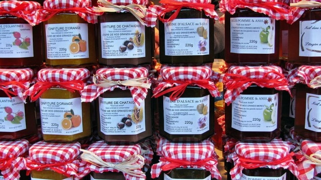
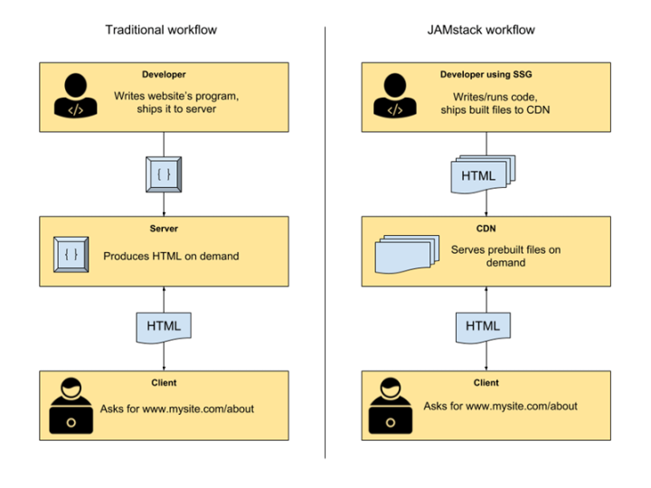
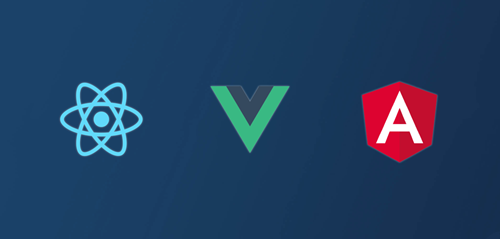
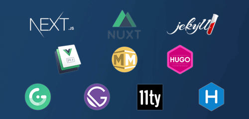
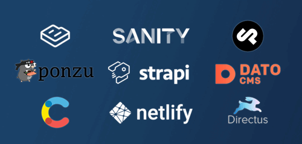
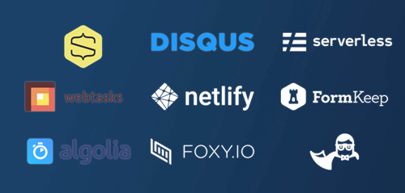



# What is JAMstack?

---
# JAMstack

> Modern web development architecture based on client-side JavaScript, reusable APIs, and prebuilt Markup.

---

## **J**avaScript

Any dynamic programming during the request/response cycle is handled by JavaScript, running entirely on the client. This could be any frontend framework like Vue.js, React, Angular, etc. or even vanilla JavaScript.

---

## **A**PIs
All server-side processes or database actions are abstracted into reusable APIs, accessed over HTTP with JavaScript. These can be custom-built or leverage third-party services.

---

## **M**arkup
Templated markup should be prebuilt at build time, usually using a site generator for content sites, or a build tool for web apps.

---

# Why JAMstack?

---

---

## Benefits

* Faster performance : Serve pre-built markup and assets over a CDN

* More secure : No need to worry about server or database vulnerabilities

* Less expensive : Hosting of static files are cheap or even free

* Scalability : No more worries about traffic

---

# How to JAMstack

---

## JavaScript Frameworks

---

## Static Site Generators

---

## Headless CMSes

---

## Third-party APIs

---
# What's not JAMstack

> Any project that relies on a tight coupling between client and server. 

* A site built with a server-side CMS like WordPress, Drupal, Joomla, or Squarespace.
* A monolithic server-run web app that relies on Ruby, Node, or another backend language.
* A single page app that uses isomorphic rendering to build views on the server at runtime.

---
# This is not JAMstack

## but this is a stack of yummy jams

---

# More on JAMstack

* 🔖 [JAMstack](https://jamstack.org/)
* 📖 [Modern Web Development on the JAMstack eBook](https://www.netlify.com/oreilly-jamstack/)
* 🎙️ [API Documentation with ReadMe and Netlify](https://www.heavybit.com/library/podcasts/jamstack-radio/ep-27-api-documentation-with-readme-and-netlify/)
