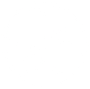



## <i class="fas fa-brain fa-4x"></i> 

# personal knowledge management 
### for writers 

--- 



# 🎙
## Xavier Roy
I work at Genesys as a Staff Technical Writer.

{}

---

## Agenda 

- ### Why? 
- ### What?
- ### How?

---

{}

#  a day in a writer's life

---

 

{}
How many sources of information are you exposed to throughout a normal work day? 
- emails
- meetings
- calls
- conversations
- online (interal and external sites)
{}

---

As writers, we deal with **information** in every part of our day.

{}

That knowledge can belong to:
- SMEs
- Other Employees
- Customers
- Teammates
- YOU too 

{}

---

 

And how many times did you find yourself searching for a key piece of information?

 
---

## Did you find it?

* ### if yes, **how**?
* ### if no, **why**?

{}
Think about how you found it? Did you go back to any original source of information like mails/tickets/intranet pages?

If you were unable to find it, why was it?
Where did you go wrong? 

{}

{}

---



{}
We all possess pieces of information (big and small) that may or may not make sense at first. But once you start collecting them and process them to bring in some form of structure, then everything starts meshing together and becomes knowledge.
{}

---

{}

# Knowledge Management (KM)
 
---

>  Knowledge Management is the process of capturing, distributing, and effectively using knowledge.

---

## KM as a discipline

> Knowledge Management is the <u>discipline</u> of enabling individuals, teams and entire organizations to collectively and systematically capture, store, create, share and apply knowledge, to better achieve their objectives. 

<small>[Wikipedia entry on KM](https://en.wikipedia.org/wiki/knowledge_management)</small>

---

## Personal Knowledge Management (PKM)

---

> Personal Knowledge Management is a <u>process</u> of collecting information that a person uses to <highlight>gather, classify, store, search, retrieve and share</highlight> knowledge in their daily activities and  the way in which these processes <u>support work activities</u>. 

<small>[Wikipedia entry on PKM](https://en.wikipedia.org/wiki/Personal_knowledge_management)</small>

---
  

The principle is that you are **responsible** for your growth and learning.

{}
PKM is a bottoms-up approach to knowledge management.
{}

---

How many sources of <highlight>knowledge</highlight> are you exposed to throughout a normal work day?

---

## What can you do to deal with it?

{} 

---
{} 

# Things that can help

* analog tools
* digital tools
* [knowledge frameworks](#knowledgeframeworks)

---
   
# Analog Tools

---

# Digital Tools

   Evernote 

   TiddlyWiki 

 
 
  OneNote  

 
 Keep

 

        
        Notion

  

        
        Roam 

  

        Obsidian

  

        <a href="#"><i class="far fa-file-alt fa-3x"></i>&nbsp;<i class="fas fa-file-word fa-3x"></i>&nbsp;<i class="fas fa-file-excel fa-3x"></i></a>Other Tools

{} 

---

{}



# TiddlyWiki

## &nbsp;
## &nbsp;
## &nbsp;
## &nbsp;

---

## what is TiddlyWiki?

TiddlyWiki is a powerful *non-linear* note-taking tool that helps you collect and structure any kind of information and work with it to get stuff done.

It is a wiki-in-a-page.

---

Think of TiddlyWiki as a file drawer of notecards. 

The notecards are called *tiddlers*. 

The notecards are linked with each other through wiki links.

---

## Use-cases 

- Documentation
 
- Journaling

- Learning Log

* <highlight>Task/Project management</highlight>
  
* Commonplacing book
  
* Review tracker

---
## Demo 
## 

---

1. Download an empty TiddlyWiki from [tiddlywiki.com](https://tiddlywiki.com).
2. (_Optional_) Install [Timimi](https://ibnishak.github.io/Timimi/).  
3. Show features. 
4. Install plugins. ([Project Manager](https://nicolas.petton.fr/tw/project-manager.html) and [Daily Notes](https://akhater.github.io/drift/#Plugin%20-%20Daily%20Notes))

---

# why?

---



## Longevity ⏳

- The [first release](https://classic.tiddlywiki.com/firstversion.html)  was in Sep 2004.
- A newer modern version, called **TW5** was released in Dec 2013.
- The older version still works fine and is renamed as **TW Classic**.

> Tiddlers created a decade ago still work. 
  

 
  

{}
* Sixteen years later, it still works.
* Unlike most other tools, this is a single file that can live anywhere, on the web, on your computer, on your phone, or on a portable media
* You can put the file on a usb or a doc sharing site like Dropbox or onedrive and access it anywhere.
{}

---

# Atomicity ⚛️

* One tiddler for one note or thought works best.
* Everything in TW is a tiddler. (I mean everything)

> Tiddlers are the fundamental units of information.

---

# Usability ✔️

* Easy to customise and adapt
* Switch between wiki markup/markdown/rich text

> Easy to learn, easy to use

---

## Adaptability 🌊

- Notetaking
- Journaling / Blogging
- Task Management
- Longform writing (Essays and Novels)
- Inventory (recipes, personal library, contacts, music collection)
- Zettelkasten
-And a whole lot of plugins

---

## Portability 💼

- Works with any web browser.
- Store in a disk / network / cloud storage / mobile device.

> Carry it anywhere and everywhere

---

## Community 🧑‍🤝‍🧑🏘️

- Help is a Google Group away
- No question is stupid
- Everyone helps including the developer

> One of the best online communities ever

---

## Security 🔐

- Unless you share, no one can access.
- Encryption available for the entire wiki.

> Your data stays with you.

{}

---

<!-- 

{}



# Obsidian

---

## what is Obsidian?

Obsidian is a powerful knowledge base that works on top of
a local folder of plain text Markdown files.

---

Think of it as a <highlight>personal knowledge base</highlight> or your <highlight>second brain</highlight>.

- Local-first and plain text
- Links as first-class citizen
- Super extensible with plugins/themes

> An IDE for your notes

{}

--> 

---

{}



# Knowledge Frameworks

- Commonplacing Book
- Zettelkasten
- PARA (Projects, Areas, Resources, Archive)
- IMF (Index, Maps, and Framework)

---

## Commonplacing Books

- Commonplace Books were the original KM tool. <small>Also known as commonplace books</small>

> a central resource or depository for ideas, quotes, anecdotes, observations and information

- Marcus Aurelius >> Thomas Jefferson >> Napoleon >> Bill Gates  

---

## Zettelkasten

- A Zettelkasten is an idea of storing and organizing your knowledge.
German for _slip box_.
- Pioneered by a German sociologist, Niklas Luhmann.
- A Zettelkasten can be analog or digital. Luhman wrote over 90000 notes on small slips of paper. 

---

## PARA

- P.A.R.A. stands for Projects — Areas — Resources — Archives.
- Introduced by [Tiago Forte](https://fortelabs.co/), a productivity expert.
- Emphasis on sorting information by actionability rather than category. 
- This system can be useful if you are organizing information as part of a project management system. 
- More about [The PARA Method](https://fortelabs.co/blog/para/)

---

## IMF (Index, Maps, and Framework)

- IMF stands for Index, Maps of Content, and Fluid Frameworks
- Designed by Nick Milo
- A framework for arranging knowledge for research, or just personal use, in a way that provides multiple pathways for finding what you seek. 

{}

---



---



<i class="fas fa-brain fa-2x"></i> 

## personal knowledge management
&nbsp;
### Xavier Roy

>Personal: <i class="fas fa-globe">&nbsp;</i>[xavierroy.com](https://xavierroy.com)  &nbsp; &nbsp;  <i class="fab fa-twitter">&nbsp;</i>[@xavierroy](https://twitter.com/xavierroy)

>UA & UX:  <i class="fas fa-globe">&nbsp;</i>[paperarrow.com](https://paperarrow.com)  &nbsp;  &nbsp; <i class="fab fa-twitter">&nbsp;</i>[@paperarrow](https://twitter.com/paperarrow)

